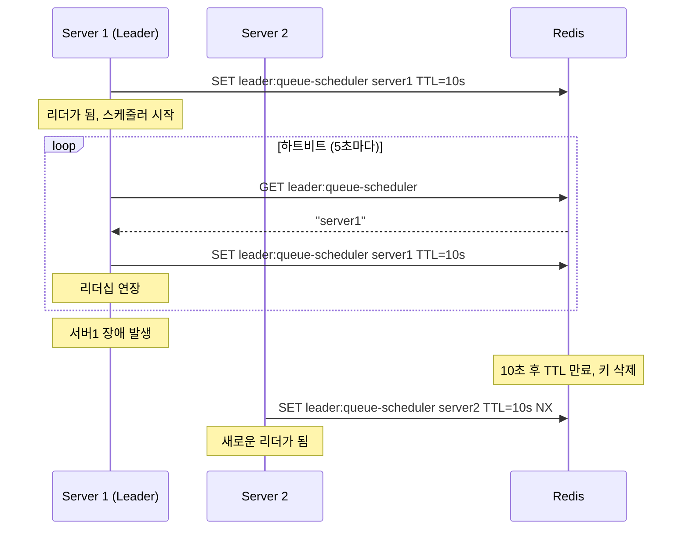

# 병목지점 개선 시행착오

### 테스트 결과
- 파일 `test/k6/reservation-kafka-multiple-seats.js`
	- 로그인 > 대기열 토큰 발급 > 예약 > 결제 흐름을 테스트함
```
✓ login_success
✓ queue_token_success
✓ charge_success
✓ reserve_success
✓ payment_success

CUSTOM
charge_latency.......................: avg=39.88436   min=8.4      med=24.371    max=167.558  p(50)=24.371    p(75)=39.3785  p(90)=84.2976   p(95)=143.43985 p(99)=158.13579 
charge_success.......................: 50     19.985051/s
login_latency........................: avg=1087.11946 min=126.085  med=1119.5225 max=1885.457 p(50)=1119.5225 p(75)=1488.797 p(90)=1754.4574 p(95)=1789.9469 p(99)=1862.28882
login_success........................: 50     19.985051/s
payment_latency......................: avg=11.28162   min=2.515    med=6.538     max=118.535  p(50)=6.538     p(75)=11.1195  p(90)=13.7317   p(95)=33.0133   p(99)=88.67636  
payment_success......................: 50     19.985051/s
queue_token_latency..................: avg=9.4592     min=1.279    med=6.207     max=53.942   p(50)=6.207     p(75)=14.2005  p(90)=22.7178   p(95)=24.0609   p(99)=40.42829  
queue_token_success..................: 50     19.985051/s
reserve_latency......................: 🔴avg=83.5775    min=10.951   med=42.875    max=371.319  p(50)=42.875    p(75)=112.418  p(90)=211.6872  p(95)=326.92135 p(99)=352.52995 
reserve_success......................: 50     19.985051/s

HTTP
http_req_duration....................: avg=246.67ms   min=1.27ms   med=21.74ms   max=1.88s    p(50)=21.74ms   p(75)=134.74ms p(90)=1.1s      p(95)=1.48s     p(99)=1.78s     
	{ expected_response:true }.........: avg=246.67ms   min=1.27ms   med=21.74ms   max=1.88s    p(50)=21.74ms   p(75)=134.74ms p(90)=1.1s      p(95)=1.48s     p(99)=1.78s     
http_req_failed......................: 0.00%  0 out of 251
http_reqs............................: 251    100.324957/s

```
### 병목 지점: 임시 예약
- reserve_latency가 전체 응답시간에서 가장 많은 부분을 차지, p(50)=42.8, p(75)=112.4로 크게 튀는 현상


### 원인: 대기열 관리 
- 유저 한 명 한 명이 예약 요청할 때마다 대기열 sorted set을 업데이트하는데,
여러 유저가 동시에 대기열을 변경하는 것을 막기 위해
- 분산락을 걸고 waiting queue -> active queue로 대기자들을 전환시키는 과정에서 
락 대기 시간이 길어지는 게 원인이었음. (100~300ms 대기)
```typescript
async updateEntireQueue(): Promise<void> {
	const lockAcquireStart = Date.now();
	await this.distributedLockService.withLock(
		getQueueUpdateLockKey(),
		5000, 
		async () => {
			const lockAcquiredTime = Date.now() - lockAcquireStart;
			this.logger.log(`[${operationId}] Lock acquired in ${lockAcquiredTime}ms`);
			/* 생략 - 대기열 큐 업데이트 */
```

---
# 개선 방법과 직면한 한계
## 개선 방법: Batch + Polling
### 배치 스케줄러
200~500ms 간격으로 batch 스케줄러에서 updateEntireQueue() 실행

```typescript
// src/queue/services/queue-scheduler.service.ts
startBatchScheduler(intervalMs = 500): void {
	if (this.intervalId) {
		this.logger.warn('Scheduler already running');
		return;
	}
	
	// 리더 선출 시도
	this.tryBecomeLeader();
	
	// 주기적으로 리더십 확인
	this.intervalId = setInterval(async () => {
		if (this.isCurrentLeader) {
			await this.updateQueueBatch(); // queueRankingService.updateEntireQueue() 호출
		} else {
			await this.tryBecomeLeader();
		}
	}, intervalMs);
	
	this.logger.log(`✅ Queue scheduler started with leader election`);
}
```


### 결과 및 한계
- **유저의 예약 요청 시점과 배치 스케줄러의 타이밍 문제로 재시도를 도입하자 latency가 훨씬 길어짐.**
- 하나의 리더 배치 스케줄러가 대기열을 관리하도록 하여, 분산락 대기 문제를 완화하고자 했으나
- waiting -> active queue로 전환되기도 전에 예약 요청이 '아직 waiting queue에 있어 예약 불가한 것'으로 간주되어 튕겨버림.
- 이를 방지하고자 대기열 토큰 검증시 maxRetries=10, retryInterval=500으로 설정한 결과, 모든 요청이 성공하기는 하나 
reserve_latency가 1초 이상으로 늘어나버림
- `verifyTokenWithRetry()`에서 maxRetries=5, retryInterval=200으로 좁혀봤으나 오히려 50명 유저 중 절반이 예약에 실패함.

```
    CUSTOM
    charge_latency......................: avg=21.00328   min=9.68     med=20.7865   max=33.676   p(50)=20.7865   p(75)=25.54225   p(90)=27.5019   p(95)=29.9351   p(99)=32.40151  
    charge_success......................: 50     15.473466/s
    login_latency.......................: avg=545.06608  min=92.783   med=556.2605  max=1055.744 p(50)=556.2605  p(75)=793.771    p(90)=960.2672  p(95)=971.09445 p(99)=1048.58363
    login_success.......................: 50     15.473466/s
    payment_latency.....................: avg=5.48894    min=1.727    med=3.8855    max=15.1     p(50)=3.8855    p(75)=5.60825    p(90)=11.7751   p(95)=14.13635  p(99)=15.03189  
    payment_success.....................: 50     15.473466/s
    queue_token_latency.................: avg=6.75588    min=1.939    med=6.345     max=13.597   p(50)=6.345     p(75)=8.772      p(90)=10.7414   p(95)=11.86105  p(99)=12.97372  
    queue_token_success.................: 50     15.473466/s
    reserve_latency.....................: 🔴avg=1083.36738 min=41.99    med=1014.4935 max=2019.487 p(50)=1014.4935 p(75)=1516.92225 p(90)=2008.3815 p(95)=2018.79   p(99)=2019.31256
    reserve_success.....................: 50     15.473466/s

    HTTP
    http_req_duration...................: avg=331.57ms   min=1.72ms   med=21.04ms   max=2.01s    p(50)=21.04ms   p(75)=542.62ms   p(90)=1.01s     p(95)=1.51s     p(99)=2.01s     
      { expected_response:true }........: avg=331.57ms   min=1.72ms   med=21.04ms   max=2.01s    p(50)=21.04ms   p(75)=542.62ms   p(90)=1.01s     p(95)=1.51s     p(99)=2.01s     
    http_req_failed.....................: 0.00%  0 out of 251
    http_reqs...........................: 251    77.676801/s

    EXECUTION
    iteration_duration..................: avg=1.66s      min=247.88ms med=1.59s     max=3.08s    p(50)=1.59s     p(75)=2.34s      p(90)=3.01s     p(95)=3.02s     p(99)=3.08s     
    iterations..........................: 50     15.473466/s
    vus.................................: 7      min=7        max=38
    vus_max.............................: 50     min=50       max=50
```

---
## 기타 개선한 점

### Heartbeat 리더 스케줄러 선출
```typescript
// 하트비트 시작
this.heartbeatInterval = setInterval(async () => {
    // TTL의 절반 주기로 실행 (예: TTL이 10초면 5초마다)
}, (this.leaderTTL * 1000) / 2);

// 리더십 확인 및 유지
const currentLeader = await this.redisService.get(this.leaderKey);

if (currentLeader === this.instanceId) {
    // 현재 서버가 리더인 경우: TTL 연장
    await this.redisService.set(this.leaderKey, this.instanceId, this.leaderTTL);
} else {
    // 리더십을 잃은 경우: 하트비트 중단
    this.isCurrentLeader = false;
    this.stopHeartbeat();
}
```

서버 장애 시나리오 해결
1. 리더 서버가 갑자기 죽는 경우
- TTL 만료 : 10초 후 자동으로 리더십 해제
- 다른 서버가 리더 선출 : 다음 주기(500ms)에 새로운 리더 선출
- 최대 지연 시간 : 10.5초 (TTL + 스케줄링 주기)
2. 네트워크 분할 (Network Partition)
- Redis와 연결이 끊긴 서버는 자동으로 리더십 상실
- Redis에 연결된 서버들 중에서 새로운 리더 선출
3. Redis 장애
- 모든 스케줄러가 중단됨 (Single Point of Failure)
- Redis 복구 시 자동으로 리더 선출 재개



<!-- ## 2. Redis Lua Script: 동시성 문제 100% 해결
- waiting → active 전환을 Lua script 하나로 원자적 처리
- zrange, zrem, zadd, zcard 모두 하나의 Redis 연산으로 처리 가능 -->
