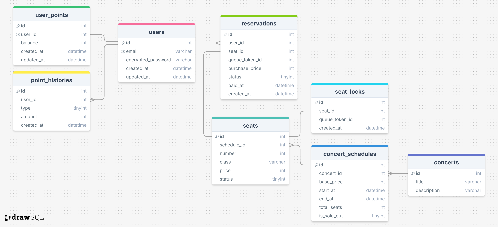

# ERD
 

---
### ERD 구성

- 콘서트별로 스케줄이 있고, 각 스케줄당 좌석 존재
- 예약페이지에서 콘서트 스케줄 및 좌석정보 조회 가능 (concert_schedules, seats)
	- 좌석 상태 (seats.status)
		- AVAILABLE: 예약 가능
		- PENDING: 예약 대기 (임시 배정 상태)
		- OCCUPIED: 판매 완료 (예약 불가)
- 예약 요청시 reservation 생성
	- 예약 상태 (reservation.status)
		- PENDING: 결제 전 (임시배정)
		- CONFIRMED: 결제완료
		- EXPIRED: 결제시간 초과
		- CANCELED: 예약 취소
- 좌석 예약 동시요청으로 인한 문제 방지 위해 seat_locks을 락으로 사용
	- 락 획득시 insert, 해제시 delete

