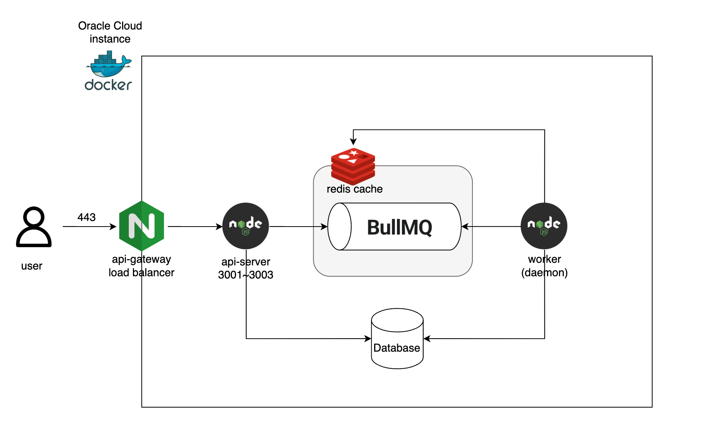

# 인프라 설계
 

---
### 설계 목적
- 대규모 예약 시스템에서의 동시성 문제와 안정적인 트래픽 처리를 위한 설계
- 대기열 큐 및 예약페이지 동시접속자 수 제한을 통해 예약 트랜잭션 환경에서 race condition 가능성 최소화
 

### 설계 구성
1. 로드밸런서
- 모든 외부 트래픽을 여러 웹 서버로 고르게 분산시켜 서버 과부하 방지.
- 특정 서버 장애 발생 시, 자동으로 트래픽을 정상 서버로 우회시켜 서비스 가용성 개선.
 

2. Redis
- 인메모리 데이터 저장소로, 초당 수만 건의 빠른 읽기/쓰기가 필요한 예약 시스템에 적합.
- 예약 시스템의 접속자 정보를 관리하며, 각 유저의 예약 요청 권한(토큰 등)을 저장.
 

3. BullMQ (Redis 기반)
- Redis의 pub/sub 기능을 활용한 비동기 메시지 큐 시스템.
- 대기열 큐(waiting)에 있는 유저가 순번이 되면 ready 상태로 전환되고, worker가 해당 유저를 consume.
- worker는 유저의 권한이 부여된 후, 정해진 시간이 지나면 Redis에서 해당 키를 삭제하여 권한을 자동 만료.
 

4. 대기열 큐(Queue)의 목적
- 예약 페이지의 동시 접속자를 N명으로 제한하여 서버 과부하 및 race condition을 방지.
- 추가 접속이 가능할 때만 대기열 큐에서 유저를 받아와, 좌석 예약 트랜잭션 환경에서 race condition 가능성을 최소화.
- 이를 통해 시스템의 일관성과 사용자 경험을 모두 보장.

