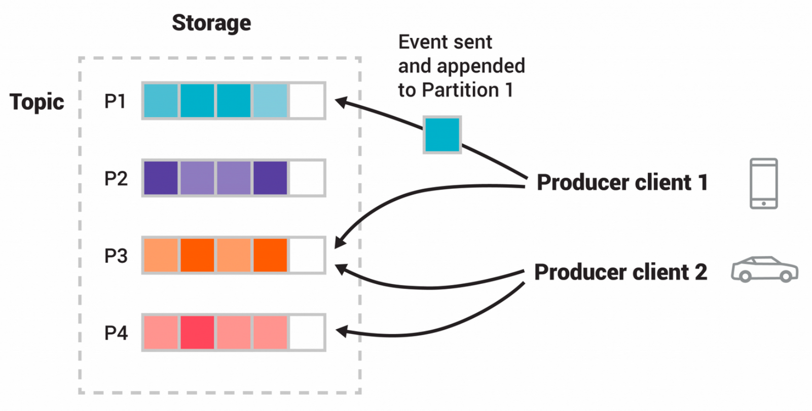

## 카프카란?
### 주요 구성요소
- Producer (생산자): 메시지(이벤트)를 만들어 카프카에 보내는 역할. (예: 주문 서비스)
- Consumer (소비자): 카프카에서 메시지를 가져와 사용하는 역할. (예: 알림 서비스, 데이터 분석 플랫폼)
- Broker (브로커): 카프카 서버 그 자체. 메시지를 물리적으로 저장하고 관리하는 창고 역할. 여러 브로커가 모여 클러스터를 이룸.
- Topic (토픽): 메시지를 종류별로 나누는 카테고리. (예: order-completed, user-joined)
- Partition (파티션): 하나의 토픽을 여러 개로 나눈 '물리적인' 저장소. 병렬 처리와 순서 보장의 핵심.


- 토픽은 파일시스템의 폴더, 이벤트는 폴더내 파일
- 카프카 토픽은 멀티 프로듀서, 멀티 컨슈머가 접근할 수 있음.
- 토픽의 이벤트는 필요한 만큼 반복해서 읽어갈 수 있음. consume 후 삭제하지 않고 특정 기간 보존하므로.
- 토픽은 서로 다른 브로커에 있는 여러 버킷으로 '파티셔닝'됨.
데이터를 분산 저장하는 것은 확장성 때문. 덕분에 클라이언트는 동시에 여러 브로커에서 데이터를 읽고 쓸 수 있음.
- 같은 이벤트 키를 가진 메시지는 같은 파티션에 기록되며, 하나의 토픽-파티션을 consume하는 모든 컨슈머는 순차적으로 해당 파티션을 읽어가는 것을 보장함.

### 카프카 특징 및 기능
- 확장성(Scalability): 트래픽이 늘어나면 브로커 서버만 추가하면 되므로 확장이 매우 쉽고 유연.
- 영속성(Durability): 메시지를 메모리가 아닌 디스크에 저장. 소비자가 메시지를 가져가도 바로 삭제되지 않고 설정된 기간 동안 보관. (장애 시 데이터 유실 방지) `KAFKA_LOG_RETENTION_MS`
- 고가용성(High-Availability): 여러 브로커로 클러스터를 구성하고, 데이터를 여러 곳에 복제(Replication)해두기 때문에 브로커 하나가 고장 나도 시스템은 멈추지 않음. `KAFKA_OFFSETS_TOPIC_REPLICATION_FACTOR`

### 카프카 도입의 장단점
#### 장점
1. 서비스 분리(Decoupling): 
- 주문 서비스는 "주문 완료" 이벤트를 카프카에 던지기만 하면 끝. 알림 서비스가 장애 나든 말든 신경 쓰지 않아도 됨. 각자 자기 책임에만 집중할 수 있음.
- 특정 서비스의 장애가 다른 서비스로 전파되지 않음. 알림 서비스가 복구되면, 카프카에 쌓여있던 메시지를 그대로 가져가 처리하면 되므로 데이터 유실도 없음.
2. 유연성, 확장성:
- 갑자기 "마케팅팀도 주문 데이터가 필요해요" 라는 요청이 온다면? 기존 코드는 건드릴 필요 없이, 마케팅팀을 위한 새로운 Consumer를 만들어 카프카 토픽에 붙이기만 하면 됨.
3. 안정성, 순서 보장:
- 선착순 이벤트 시, 모든 요청을 일단 카프카에 받아둠. 따라서 갑자기 트래픽이 몰리더라도 서버는 안정적으로 처리할 수 있음.
- **같은 메시지 키(예: 유저 ID)를 사용하면 항상 같은 파티션**으로 메시지가 전송됨. 하나의 파티션은 하나의 컨슈머만 처리하므로 순서가 보장됨. 동시에 파티션을 여러 개 두면 **병렬 처리**로 처리량까지 높일 수 있음.

#### 단점
1. 운영 복잡성 증가:
- 카프카는 '설치하고 잊는' 솔루션이 아님. 브로커, 주키퍼(또는 KRaft) 클러스터 상태를 지속적으로 모니터링하고 관리해야 함. 운영 비용과 학습 곡선이 분명히 존재.
2. 직접적인 데이터 추적의 어려움:
- 대기열 시스템(예: Redis)처럼 "현재 큐에 몇 개의 메시지가 남아있지?"를 실시간으로 정확히 파악하기는 어려움. 카프카는 데이터의 흐름(Stream)에 더 초점을 맞춘 시스템.


### KRaft
카프카 브로커 클러스터내 컨트롤러를 선출하기 위해 zookeeper 같은 외부 의존성이 아니라 카프카 내부적으로 컨트롤러를 운영하기 위해 KRaft 모드를 사용.
(컨트롤러 역할: 파티션의 리더 선출)

**역할 분리**
도커로 운영시 - 브로커 컨테이너와 별개로 컨트롤러 전용 컨테이너도 만듦.
- KRaft 모드는 zookeeper(자동 선출)와 달리 브로커와 컨트롤러가 구분된 프로세스/노드.
- controller quorum (즉, 컨트롤러 집합) 이라는 클러스터의 핵심 메타데이터 결정 서버 셋을 직접 지정해야 함

```shell
# 컨트롤러 전용 컨테이너
docker run ... 컨트롤러 이미지 ... kafka-server-start.sh /etc/kafka/controller.properties

# 브로커 컨테이너
docker run ... 브로커이미지 ... kafka-server-start.sh /etc/kafka/server.properties
```

```yaml
controller1:
  image: confluentinc/cp-kafka:7.6.1
  command: ["kafka-server-start.sh", "/etc/kafka/controller.properties"]
  ...
controller2:
  ...
controller3:
  ...
```