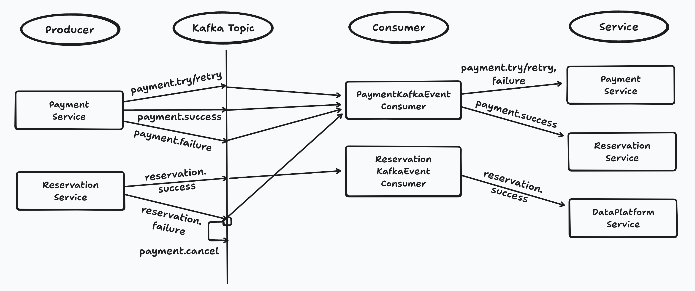
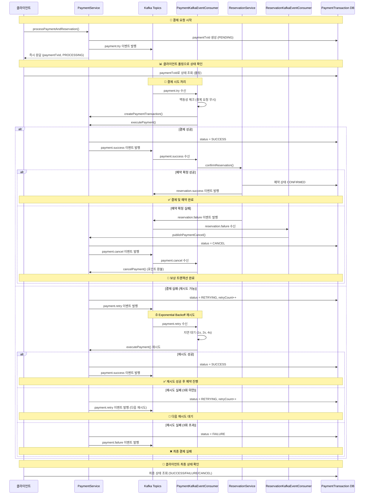
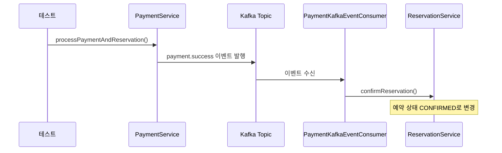
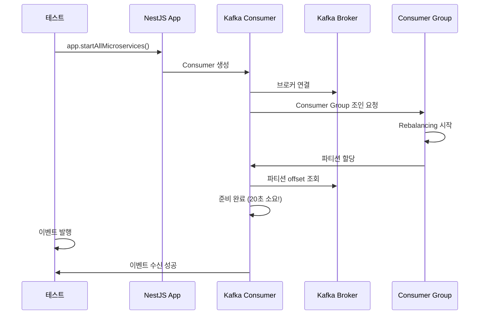

### 구현내용
#### Kafka 이벤트 producer, consumer 도식화


1. 완전한 이벤트 기반 아키텍처
- payment.try → payment.success/retry → payment.failure/cancel
- 모든 상태 변화가 Kafka 이벤트로 처리

2. 재시도 메커니즘
- Exponential Backoff: 1s, 2s, 4s 지연
- 최대 3회 재시도 후 최종 실패 처리
- 멱등성 보장: 중복 요청 무시

3. 보상 트랜잭션
- reservation.failure → payment.cancel → 포인트 환불
- 예약 실패 시 자동 결제 취소

4. 클라이언트 폴링
- paymentTxId로 실시간 상태 확인
- 비동기 처리 결과를 안전하게 추적

#### 시퀀스 다이어그램

---

### Phase1. 카프카 설정
- 카프카 컨슈머, 프로듀서 설정
- `KafkaEventBus` 클래스로 이벤트 발행(kafkaClient.emit) 추상화
    - CommonModule에 `EVENT_BUS` 토큰으로 NestEventBus 또는 KafkaEventBus를 주입하여 자유롭게 단일 프로세스 or 분산 이벤트구조 선택 가능
    - ```
    	{
			provide: EVENT_BUS,
			useClass: KafkaEventBus, // NestEventBus 대신
		}
- `@EventPattern(토픽명)` 데코레이터로 이벤트 수신 (@Controller)
```typescript
// main.ts - Consumer 등록
// Kafka 마이크로서비스를 HTTP 앱에 연결
app.connectMicroservice<MicroserviceOptions>({
    transport: Transport.KAFKA,
    options: {
        client: {
            clientId: 'ticketing-consumer',
            brokers: ['localhost:9092', 'localhost:9093', 'localhost:9094'], // 클러스터 전체
        },
        consumer: {
            groupId: 'ticketing-consumer-group', // 통합 이벤트 그룹
        },
    },
});

await app.startAllMicroservices();
logger.log('🎧 Kafka Consumer is running...');

// kafka-client.module.ts - Producer
@Module({
	imports: [
		ClientsModule.register([
			{
				name: 'KAFKA_SERVICE',
				transport: Transport.KAFKA,
				options: {
					client: {
						// producer
						clientId: 'ticketing-producer',
						brokers: ['localhost:9092', 'localhost:9093', 'localhost:9094'],
					},
				},
			},
		]),
	],
	exports: [ClientsModule], // Producer가 있는 다른 모듈에서 사용 가능
})
export class KafkaClientModule {}

// kafka-event-bus.ts - Producer
@Injectable()
export class KafkaEventBus implements IEventBus {
	private readonly logger = new Logger(KafkaEventBus.name);
	constructor(
		@Inject('KAFKA_SERVICE') private readonly kafkaClient: ClientKafka, // kafka-client.module에서 등록한 producer
	) {}

	publish<T extends IEvent>(event: T): void {
		this.logger.log(`Publishing event: ${event.eventName}`);

		const kafkaEvent = {
			eventId: `${event.eventName}-${Date.now()}-${Math.random().toString(36).substring(2, 9)}`,
			...event,
		};
		this.kafkaClient.emit(event.eventName, kafkaEvent);
	}

	async onModuleInit(): Promise<void> {
		// Kafka 연결 대기
		await this.kafkaClient.connect();
		this.logger.log('Kafka EventBus connected');
	}
}

// payment-kafka-event.consumer.ts - Consumer
@Controller()
export class PaymentKafkaEventConsumer {
	private readonly logger = new Logger(PaymentKafkaEventConsumer.name);

	constructor(
		private readonly paymentService: PaymentService,
		private readonly reservationService: ReservationService,
	) {}

	@EventPattern('payment.success')
	async onPaymentSuccess(
		@Payload() event: PaymentSuccessKafkaEvent,
	): Promise<void> {
		try {
			this.logger.log(
				`[Kafka] Received payment.success event: ${event.eventId}`,
			);
			console.log('hihi payment.success event received');

			const { reservationId } = event.data;
			await this.reservationService.confirmReservation(reservationId);
			return;
		} catch (error) {
			this.logger.error(
				`[Kafka] Failed to process payment.success event: ${error.message}`,
			);
		}
	}
}
```

---
### Phase2. 결제 상태별 이벤트 발행 및 처리
- 완전한 이벤트 기반으로 수정.
	- 결제 프로세스를 payment try - success or retry - fail - cancel 로 나누어
	- payment.try 이벤트 컨슈머에서 실제 결제를 진행하는 함수 `executePayment()`를 호출,
		- 결제 성공시 payment.success 이벤트 발행,(최종예약 프로세스로 넘어감)
		- 결제 실패시 payment.retry 이벤트 발행
	- retry는 3번 재시도 실패시 payment.failure 이벤트 발행
- 각 이벤트 단계에서 트랜잭션 키(paymentTxId)를 통해 DB payment_transactions 테이블의 status를 업데이트
	- 이로써 클라이언트는 paymentTxId를 통해 결제상태(payment_transactions.status)를 폴링으로 확인할 수 있음
- paymentTxId: 결제 트랜잭션 ID 중복 결제 방지

```typescript
// payment.service.ts
async processPaymentAndReservation(
	userId: number,
	reservationId: number,
	paymentToken: string,
	paymentTxId?: string,
): Promise<PaymentProcessResponseDto> {
	if (!paymentTxId) {
		paymentTxId = uuidv4();
	}
	// verify
	const isValidToken = await this.paymentTokenService.verifyToken(
		userId,
		paymentToken,
		TokenStatus.WAITING,
	);
	if (!isValidToken) {
		throw new Error('Invalid payment token');
	}

	// 예약 정보 조회
	const reservation = await this.reservationRepository.findOne(reservationId);
	const seatId = reservation.seatId;
	const amount = reservation.purchasePrice;

	// 첫번째 시도인 경우 payment.try 이벤트 발행
	this.paymentEventPublisher.publishPaymentTry(
		reservationId,
		userId,
		seatId,
		amount,
		paymentTxId,
		paymentToken,
	);

	// 즉시 응답 반환. 클라이언트 폴링으로 paymentTransaction.status 확인
	return {
		paymentTxId,
		status: 'PAYMENT_PROCESSING',
		message: '결제 처리 중입니다. 잠시 후 결과를 확인해주세요.',
	};
}

// payment-kafka-event.consumer.ts
@EventPattern('payment.try')
async onPaymentTry(@Payload() event: PaymentTryKafkaEvent): Promise<void> {
	try {
		const {
			reservationId,
			userId,
			seatId,
			amount,
			paymentTxId,
			paymentToken,
		} = event.data;
		const pendingTransaction =
			await this.paymentService.findPendingTransaction(paymentTxId);
		if (pendingTransaction) {
			return; // 멱등성 보장: 중복 요청 무시
		}

		await this.paymentService.createPaymentTransaction(
			paymentTxId,
			userId,
			seatId,
		);
		await this.paymentService.executePayment(
			reservationId,
			userId,
			seatId,
			amount,
			paymentTxId,
			paymentToken,
		);
	} catch (error) {
		// 에러 발생 시 payment.retry 이벤트 발행
		try {
			const {
				reservationId,
				userId,
				seatId,
				amount,
				paymentTxId,
				paymentToken,
			} = event.data;
			await this.paymentService.publishPaymentRetry(
				reservationId,
				userId,
				seatId,
				amount,
				paymentTxId,
				paymentToken,
				1,
				error.message,
			);
		} catch (publishError) {
			this.logger.error(
				`[Kafka] Failed to publish payment.retry event: ${publishError.message}`,
			);
		}
	}
}

// reservation-kafka-event.consumer.ts
// 최종예약 단계에서 실패시 payment.cancel 보상 트랜잭션 이벤트 발행
@EventPattern('reservation.failure')
async onReservationFailure(
	@Payload() event: ReservationFailureKafkaEvent,
): Promise<void> {
	try {
		this.logger.log('[Kafka] reservation.failure event received');

		const { reservationId, userId, seatId, amount, paymentTxId, reason } =
			event.data;
		// 결제 취소
		await this.paymentService.publishPaymentCancel(
			reservationId,
			userId,
			seatId,
			amount,
			paymentTxId,
			reason,
		);
		// 데이터 전송
		await this.dataPlatformService.send(event);
	} catch (error) {
		this.logger.error(
			`[Kafka] Failed to process reservation.failure event: ${error.message}`,
		);
	}
}

// payment.service.ts
// 컨슈머에서 또다른 이벤트를 발행할 때(연쇄작용), 반드시 PaymentService를 통해 발행
// PaymentService는 트랜잭션 상태 업데이트 후 이벤트 발행
async publishPaymentCancel(
	reservationId: number,
	userId: number,
	paymentTxId: string,
	reason: string,
): Promise<void> {
	// 1. 트랜잭션 상태 업데이트
	await this.paymentTransactionRepository.updateStatus(
		paymentTxId,
		PaymentTransactionStatus.CANCEL,
	);
	// 2. 취소 이벤트 발행
	this.paymentEventPublisher.publishPaymentCancel(
		reservationId,
		userId,
		paymentTxId,
		reason,
	);
}
```

---
### 3. TODO: 메시지 키 추가
- 메시지 키: `userId-seatId` 특정 좌석 결제에 대한 순서 보장
- 메시지 value: 
	- 컨슈머에서 작업을 실행하기 위해 필요한 데이터를 충분히 포함하여, DB 조회 횟수를 최소화하고자 함. 
		- userId, seatId, amount, paymentTxId, paymentToken 등 
	- 재시도 이벤트는 retryCount 추가

```typescript
// kafka-event-bus.ts
@Injectable()
export class KafkaEventBus implements IEventBus {
	private readonly logger = new Logger(KafkaEventBus.name);
	private producer: Producer; // 🟡 kafkajs 직접 사용!!

	constructor(
		@Inject('KAFKA_SERVICE') private readonly kafkaClient: ClientKafka,
	) {}

	publish<T extends IEvent>(
		event: T, // messageValue와 동일
		messageKey?: string,
	): void {
		this.logger.log(`Publishing event: ${event.eventName}`);

		const kafkaEvent = {
			eventId: `${event.eventName}-${Date.now()}-${Math.random().toString(36).substring(2, 9)}`,
			...event,
		};
		if (messageKey) {
			this.producer.send({
				topic: event.eventName,
				messages: [
					{
						key: messageKey,
						value: JSON.stringify(kafkaEvent),
					},
				],
			});
		} else {
			this.kafkaClient.emit(event.eventName, kafkaEvent);
		}
	}

	async onModuleInit(): Promise<void> {
		// Kafka 연결 대기
		await this.kafkaClient.connect();
		// 연결 후 producer 초기화
		this.producer = this.kafkaClient.producer;
		await this.producer.connect();
		this.logger.log('Kafka EventBus connected');
	}
}

// payment-event.publisher.ts
@Injectable()
export class PaymentEventPublisher {
	constructor(
		@Inject(EVENT_BUS)
		private readonly eventBus: IEventBus,
	) {}

	async publishPaymentTry(
		reservationId: number,
		userId: number,
		seatId: number,
		amount: number,
		paymentTxId: string,
		paymentToken: string,
	): Promise<void> {
		const event = new PaymentTryKafkaEvent({
			reservationId,
			userId,
			seatId,
			amount,
			paymentTxId,
			paymentToken,
		});
		const messageKey = `${userId}-${seatId}`;
		this.eventBus.publish(event, messageKey);
	}
}
```


---
### 기타 memo
#### Nesjs microservice kafka 문서
Kafka client, consumer 설정이 두 군데인데
- main.ts : 서버역할
- kafka-module.ts : 컨슈머 역할 따로 등록한듯.
client는 딱히 별 의미 없고 mysql client랑 비슷한 존재.

event-based : emit
message-based : send.

Consumer가 컨트롤러임.
@EventPattern('reservation.success') 이런 이벤트 네임이 API URI 같은거고.
이벤트를 수신하는거니까. HTTP 통신이 아닐 뿐. 

(참고) Nestjs 마이크로서비스
NestJS 마이크로서비스란 HTTP가 아닌 다른 전송 계층(Transport Layer)을 사용하는 애플리케이션을 의미
- 같은 컴포넌트가 http, websocket, microservice에 걸쳐 통용될 수 있음.

패턴 두 종류
1. Message 패턴 = Request-Response
두 개의 파이프라인(채널)을 유지. 요청을 보내고 답장 올 때까지 기다림.
2. Event 패턴 
- 응답 기다리지 않음. 

Kafka는 ClientProxy 대신 **Kafka 전용 대리인인 ClientKafkaProxy**를 사용
- Kafka는 본질적으로 단방향 '방송' 시스템입니다. A가 B에게 메시지를 보내면 끝입니다. B가 A에게 직접 답장을 보내는 내장 기능이 없습니다.
> 응답용 토픽(Reply Topic) 관리
> 응답 구독: ClientKafkaProxy는 응답을 받기 위해 자기 스스로가 Consumer(소비자)가 됨
응답을 받기 위해 consumer.groupId 설정해야. 

---
파티션 병렬 처리를 위한 방법
- 동일한 앱을 여러 인스턴스로 실행
```
payment.success 토픽 (3개 파티션)
├── partition-0 → 인스턴스1 (port 3001)
├── partition-1 → 인스턴스2 (port 3002)
└── partition-2 → 인스턴스3 (port 3003)
```

---
### Kafka 설계: MSA와는 직접적 관계 없음
단계적 분리(현재구조 유지)
```
src/
├── main.ts                       					# 기존 HTTP API 서버 + Kafka Consumer 서버 hybrid
├── common/                       
│       └── kafka-event-bus.ts   					# Kafka Producer 추상화 EventBus
├── payment/
│   ├── application/event-publishers/
│   │    └── payment-event.publisher.ts 			# Kafka Producer
│   ├── infrastructure/
│   │   └── consumers/
│   │      └── payment-event.consumer.ts 			# Kafka Consumer
├── ticketing/
│   ├── application/event-publishers/
│   │    └── ticketing-event.publisher.ts 			# Kafka Producer
│   ├── infrastructure/
│   │   └── consumers/
│   │      └── ticketing-event.consumer.ts 			# Kafka Consumer
└── kafka-client/                 					# 공통 Kafka Producer 설정
```

현재 구조 (Monolith + Kafka)
```
단일 서버 (port 3000)
├── HTTP API (Controller)
├── Business Logic (Service)  
├── Kafka Producer (EventPublisher)
└── Kafka Consumer (EventConsumer)
```


MSA 분리 후 구조
```
API Gateway (port 3000)     Payment Service (port 3001)    Reservation Service (port 3002)
├── HTTP Routes             ├── Payment Logic              ├── Reservation Logic
├── Auth/Queue Logic        ├── Kafka Producer             ├── Kafka Consumer
└── HTTP Client calls       └── Database                   └── Database

                           Kafka Cluster (9092, 9093, 9094)
                           ├── payment.success topic
                           ├── payment.cancel topic  
                           └── reservation.confirmed topic
```

---
프로듀서 - 컨슈머

---
카프카 컨슈머(이벤트 수신) 준비가 오래 걸리는 이유.. 브로커 join


---
### 실제 필요한 Kafka 이벤트
💎 필수 (비동기 처리):
```
payment.success → reservation.confirm
reservation.fail → payment.refund
reservation.timeout → payment.refund
```

불필요 (동기 HTTP):
```
로그인 → 즉시 응답
대기열 토큰 발급 → 즉시 응답
좌석 조회 → 즉시 응답
```

---
### Docker 설정
#### 컨테이너간 통신 문제
Docker 컨테이너 간 네트워크 통신 문제로 인해 Kafka 클러스터 내부 상태 조회가 안되는 상황


#### (기타) MSA 및 네트워크 설정
MSA에서는 서비스 간 통신을 위해 Docker 네트워크가 필요:


```yaml
networks:
  ticketing-network:
    driver: bridge
```
각 서비스가 ticketing-network를 통해 서로 통신하고, Kafka 브로커들과 연결됩니다.

결론
현재 Kafka 클러스터 설정은 이미 MSA 준비가 되어 있습니다. 주요 변화는:

서비스 분리: 각각 독립적인 컨테이너로 실행
통신 방식: 메모리 호출 → HTTP + Kafka 이벤트
안정성 강화: 복제본 설정 증가
네트워크 설정: Docker 네트워크로 서비스 간 통신
로그인, 대기열 등은 말씀하신 대로 HTTP만으로 충분하고, 결제→예약 같은 비즈니스 크리티컬한 플로우만 Kafka 이벤트를 사용하면 됩니다.