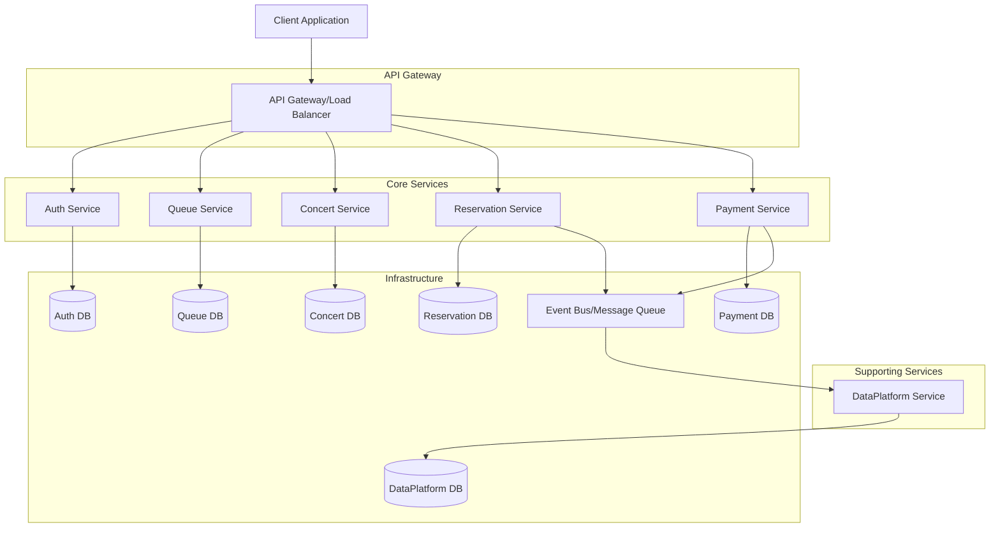

# MSA 구조 설계 문서

## 1. 현재 모놀리식 구조

### 1.1 현재 아키텍처
```
Ticketing Monolith
├── Auth Module (인증/인가)
├── Ticketing Module (대기열/좌석/예약)
├── Payment Module (결제/잔액조회)
└── DataPlatform Module (예약현황 로그 전송)
```

### 1.2 현재 이벤트 흐름
```
임시예약 → 결제 → 예약확정 → 데이터플랫폼 전송
```

## 2. MSA 도메인 분리 설계

### 2.1 배포 단위별 도메인 분리

#### **Auth Service** 🔐
- **책임**: 사용자 인증, 인가, JWT 토큰 관리
- **데이터**: User, Role, Permission
- **API**: `/auth/signup`, `/auth/login`

#### **Queue Service** 🚦
- **책임**: 대기열 관리, 토큰 발급/검증
- **데이터**: QueueToken, WaitingQueue, ActiveQueue
- **API**: `/queue/token`, `/queue/status`

#### **Concert Service** 🎵
- **책임**: 콘서트, 스케줄, 좌석 관리
- **데이터**: Concert, Schedule, Seat
- **API**: `/ticketing/search/concerts/{id}/schedules`, `/ticketing/search/schedules/{scheduleId}/seats`

#### **Reservation Service** 🎫
- **책임**: 임시 예약 생성, 최종 예약, 예약 상태 조회
- **데이터**: Reservation
- **API**: `/ticketing/reservations/new`, `/ticketing/reservations/confirm`, `/ticketing/reservations/{id}`

#### **Payment Service** 💳
- **책임**: 포인트 충전, 결제 처리, 잔액 조회 
- **데이터**: Payment, Balance, PaymentHistory
- **API**: `/payments/charge`, `/payments/process`, `/balance`

#### **DataPlatform Service** 📊
- **책임**: 예약 이벤트 로그 수집 및 분석
- **데이터**: Reservation
- **API**: `/data-platform/reservations`

---
### 2.2 MSA 아키텍처 다이어그램



---
## 3. 분산 트랜잭션 처리의 한계와 해결방안

### 3.1 트랜잭션 처리의 한계

#### **ACID 속성 보장의 어려움**
- **원자성**: 여러 서비스에 걸친 트랜잭션의 All-or-Nothing 보장 불가
- **일관성**: 서비스 간 데이터 일관성 유지 복잡
- **격리성**: 분산 환경에서 동시성 제어 어려움
- **지속성**: 네트워크 장애 시 데이터 손실 위험

#### **구체적인 문제 시나리오**
```
1. 예약 생성 성공 → 결제 실패 → 예약 데이터 정리 필요
2. 결제 성공 → 좌석 상태 업데이트 실패 → 결제 취소 필요
3. 네트워크 장애로 인한 부분 실패 상황
```

---
### 3.2 해결방안: Saga 패턴 적용

#### **3.2.1 Choreography-based Saga (이벤트 기반)**

**현재 구현된 방식**
```typescript
// 예약 흐름
1. temporaryReserve() → 임시예약 생성
2. processPayment() → 결제 처리 + payment.success 이벤트 발행
3. PaymentEventListener → reservation.confirmReservation() 호출
4. confirmReservation() → 예약 확정 + reservation.success 이벤트 발행
```

**보상 트랜잭션 구현**
```typescript
// ReservationService
async confirmReservation(reservationId: number): Promise<void> {
  try {
    // 예약 확정 로직
    await this.reservationRepository.updateStatus(reservationId, 'CONFIRMED');
    await this.seatRepository.updateStatus(seatId, 'SOLD');
    
    // 성공 이벤트 발행
    this.eventBus.emit('reservation.success', new ReservationSuccessEvent(...));
  } catch (error) {
    // 실패 시 보상 이벤트 발행
    this.eventBus.emit('reservation.failed', new ReservationFailedEvent(reservationId));
  }
}

// PaymentEventListener
@OnEventSafe('reservation.failed')
async onReservationFailed(event: ReservationFailedEvent): Promise<void> {
  // 결제 취소 (보상 트랜잭션)
  await this.paymentService.cancelPayment(event.paymentId);
  this.eventBus.emit('payment.cancelled', new PaymentCancelledEvent(...));
}
```

#### **3.2.2 Orchestration-based Saga (중앙 집중식)**

**Reservation Saga Orchestrator 구현**
```typescript
@Injectable()
export class ReservationSagaOrchestrator {
  async executeReservationSaga(request: ReservationRequest): Promise<void> {
    const sagaId = generateSagaId();
    
    try {
      // Step 1: 임시 예약
      const reservation = await this.reservationService.createTemporaryReservation(request);
      
      // Step 2: 결제 처리
      const payment = await this.paymentService.processPayment({
        userId: request.userId,
        amount: request.amount,
        reservationId: reservation.id
      });
      
      // Step 3: 예약 확정
      await this.reservationService.confirmReservation(reservation.id);
      
      // Step 4: 알림 발송
      await this.notificationService.sendReservationConfirmation(request.userId);
      
    } catch (error) {
      // 보상 트랜잭션 실행
      await this.executeCompensation(sagaId, error);
    }
  }
  
  private async executeCompensation(sagaId: string, error: Error): Promise<void> {
    // 역순으로 보상 작업 실행
    const sagaLog = await this.getSagaLog(sagaId);
    
    for (const step of sagaLog.completedSteps.reverse()) {
      await this.executeCompensationStep(step);
    }
  }
}
```

### 3.3 이벤트 기반 아키텍처 고도화

#### **3.3.1 Event Sourcing 패턴**
```typescript
// 이벤트 저장소
@Entity()
export class EventStore {
  @PrimaryGeneratedColumn()
  id: number;
  
  @Column()
  aggregateId: string;
  
  @Column()
  eventType: string;
  
  @Column('json')
  eventData: any;
  
  @Column()
  version: number;
  
  @CreateDateColumn()
  createdAt: Date;
}

// 이벤트 기반 예약 상태 관리
export class ReservationAggregate {
  private events: DomainEvent[] = [];
  
  createReservation(command: CreateReservationCommand): void {
    const event = new ReservationCreatedEvent(command);
    this.applyEvent(event);
  }
  
  confirmReservation(): void {
    if (this.status !== 'TEMPORARY') {
      throw new Error('Cannot confirm non-temporary reservation');
    }
    
    const event = new ReservationConfirmedEvent(this.id);
    this.applyEvent(event);
  }
  
  private applyEvent(event: DomainEvent): void {
    this.events.push(event);
    this.apply(event);
  }
}
```

#### **3.3.2 CQRS (Command Query Responsibility Segregation)**
```typescript
// Command Side
@CommandHandler(CreateReservationCommand)
export class CreateReservationHandler {
  async execute(command: CreateReservationCommand): Promise<void> {
    const aggregate = new ReservationAggregate();
    aggregate.createReservation(command);
    
    await this.eventStore.save(aggregate.getUncommittedEvents());
  }
}

// Query Side
@QueryHandler(GetReservationQuery)
export class GetReservationHandler {
  async execute(query: GetReservationQuery): Promise<ReservationView> {
    return await this.reservationViewRepository.findById(query.reservationId);
  }
}
```

## 4. 구현된 안전장치

### 4.1 OnEventSafe 데코레이터
```typescript
@OnEventSafe('payment.success')
async onPaymentSuccess(event: PaymentSuccessEvent): Promise<void> {
  // 예외 발생 시 자동으로 로깅하고 다른 리스너에 영향 없음
}
```

### 4.2 멱등성 보장
```typescript
@Injectable()
export class IdempotentEventHandler {
  private processedEvents = new Set<string>();
  
  @OnEventSafe('payment.success')
  async handlePaymentSuccess(event: PaymentSuccessEvent): Promise<void> {
    const eventKey = `${event.type}-${event.paymentId}-${event.timestamp}`;
    
    if (this.processedEvents.has(eventKey)) {
      return; // 이미 처리된 이벤트
    }
    
    await this.processEvent(event);
    this.processedEvents.add(eventKey);
  }
}
```

### 4.3 재시도 메커니즘
```typescript
@Injectable()
export class RetryableEventHandler {
  @OnEventSafe('reservation.confirm')
  @Retry({ attempts: 3, delay: 1000 })
  async handleReservationConfirm(event: ReservationConfirmEvent): Promise<void> {
    // 일시적 실패 시 자동 재시도
  }
}
```

## 5. 모니터링 및 운영

### 5.1 분산 추적
```typescript
// Correlation ID를 통한 요청 추적
export class CorrelationIdMiddleware {
  use(req: Request, res: Response, next: NextFunction): void {
    req.correlationId = req.headers['x-correlation-id'] || generateId();
    res.setHeader('x-correlation-id', req.correlationId);
    next();
  }
}
```

### 5.2 Circuit Breaker 패턴
```typescript
@Injectable()
export class PaymentServiceClient {
  @CircuitBreaker({ threshold: 5, timeout: 10000 })
  async processPayment(request: PaymentRequest): Promise<PaymentResponse> {
    // 외부 결제 서비스 호출
    // 실패율이 임계값을 초과하면 Circuit Open
  }
}
```

## 6. 배포 및 확장성 고려사항

### 6.1 데이터베이스 분리 전략
- **Database per Service**: 각 서비스별 독립적인 데이터베이스
- **Shared Database Anti-pattern 회피**
- **데이터 동기화**: Event-driven 방식으로 필요한 데이터만 복제

### 6.2 API Gateway 패턴
- **라우팅**: 클라이언트 요청을 적절한 서비스로 라우팅
- **인증/인가**: 중앙집중식 보안 처리
- **Rate Limiting**: 서비스별 요청 제한
- **로드 밸런싱**: 서비스 인스턴스 간 부하 분산

### 6.3 서비스 디스커버리
- **동적 서비스 등록/해제**
- **헬스 체크**: 서비스 상태 모니터링
- **로드 밸런싱**: 가용한 인스턴스로 요청 분산

## 7. 결론

현재 구현된 이벤트 기반 아키텍처는 MSA로의 전환을 위한 좋은 기반을 제공합니다. 

**주요 장점:**
- 서비스 간 느슨한 결합
- 보상 트랜잭션을 통한 데이터 일관성 보장
- 이벤트 기반 비동기 처리로 성능 향상
- OnEventSafe 데코레이터를 통한 안정성 확보

**향후 개선 방향:**
- Saga Orchestrator 도입으로 복잡한 비즈니스 플로우 관리
- Event Sourcing을 통한 완전한 감사 추적
- CQRS 패턴으로 읽기/쓰기 성능 최적화
- 분산 추적 시스템 도입으로 운영 가시성 확보


<!-- 
## 이벤트 기반 아키텍처 설계 기본개념
### 1. 이벤트 발행 시점 결정 기준

#### 1.1 비즈니스 이벤트 발행 시점
- **트랜잭션 커밋 후**: 데이터 일관성이 보장된 후 이벤트 발행
- **상태 변경 완료 후**: 도메인 객체의 상태가 완전히 변경된 후
- **외부 의존성 호출 전**: 외부 API 호출 전에 내부 이벤트 먼저 처리

#### 1.2 보상 이벤트 발행 시점
- **실패 감지 즉시**: 비즈니스 로직 실패 시 즉시 보상 이벤트 발행
- **타임아웃 발생 시**: 일정 시간 내 응답이 없을 때 보상 처리

## 2. 이벤트 구독 위치 결정 기준

### 2.1 도메인별 이벤트 리스너 배치
```
src/
├── payment/
│   └── infrastructure/
│       └── event-listeners/
│           └── payment-event.listener.ts    # 결제 관련 이벤트 처리
├── ticketing/
│   └── infrastructure/
│       └── event-listeners/
│           └── reservation-event.listener.ts # 예약 관련 이벤트 처리

```
### 2.2 이벤트 리스너 책임 분리
- **단일 책임**: 하나의 리스너는 하나의 도메인 이벤트만 처리
- **느슨한 결합**: 다른 도메인의 구현 세부사항에 의존하지 않음 -->
