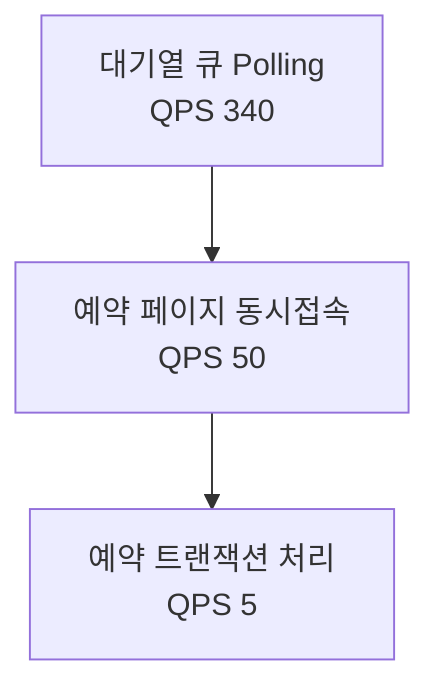

# 요구사항 분석

## 기능적 요구사항
1. 유저 대기열 토큰 기능
2. 예약 가능 날짜, 좌석 조회
3. 좌석 예약 요청
4. 잔액 충전/조회
5. 결제 요청

---
## 비기능적 요구사항

### 트래픽 추산

#### 1. 대기열 큐 진입 트래픽
- 한 콘서트당 10,000명의 유저가 예약을 시도한다고 가정
- 예약 페이지 진입을 위한 대기열 큐(max slot: 10,000)
- 대기열 순번별 polling 빈도:
    - 상위 100명: 1초마다 polling
    - 다음 900명: 10초마다 polling
    - 이후 9,000명: 60초마다 polling

| 구간         | 인원  | polling 주기 | 1초당 쿼리수 |
| ------------ | ----- | ------------ | ------------ |
| 1~100        | 100   | 1초          | 100          |
| 101~1,000    | 900   | 10초         | 90           |
| 1,001~10,000 | 9,000 | 60초         | 150          |
| **합계**     |       |              | **340 QPS**  |

> **QPS 계산식**: 100/1 + 900/10 + 9000/60 = **340 QPS**

 

#### 2. 예약 페이지 동시접속 트래픽
- 동시접속자: 100명 (최대 100개의 worker가 동시에 job consume)
- 유저당 2~3초에 한 번 조회 쿼리 발생

> **QPS 계산식**: 100 / 2 = **50 QPS**

 

#### 3. 예약 트랜잭션 처리량
- 예약 페이지 유지 시간: 3분(180초)
- 최대 트랜잭션: 100건 (3분 동안 100명)

| 조건                    | 계산식         | TPS  |
| ----------------------- | -------------- | ---- |
| 기본 트랜잭션           | 100 / 180      | 0.55 |
| 재시도 포함(3회/인)     | 300 / 180      | 1.67 |
| 오픈 피크(최대 추정치)  | -              | 10~100 |

- 락 실패, 빠른 반복 재시도로 실제 TPS는 더 높아질 수 있음
- 오픈 직후(5초~1분)에 순간 피크 발생 가능

 

---
## 기술 스택 & 제약 조건

- **Backend**: TypeScript (NestJS)
- **인프라**: Docker 기반 컨테이너 환경
- **로드밸런서**: Nginx
- **Authentication(권한/인가)**: Redis + JWT
- **비동기 처리**: BullMQ (Redis 기반)
- **DB**: RDBMS (예: MySQL)
- **클라우드/운영 환경**: 로컬에서 도커로 여러 서버 환경 구축

### 기술 스택 선택 기준 및 현실적 제약
- **운영 환경의 단순화**: 로컬 및 소규모 클라우드 환경에서도 손쉽게 배포·운영할 수 있도록 컨테이너(Docker) 기반 아키텍처를 선택
- **구성 요소의 신뢰성**: Redis, BullMQ 등은 오픈소스이면서도 널리 검증된 미들웨어로, 학습 비용과 운영 비용을 최소화할 수 있음
- **비용/운영 리소스 제약**: 상용 메시지 브로커, 고가의 클라우드 서비스 대신 오픈소스와 자체 서버 기반으로 시스템을 구성함
- **단일 장애점 최소화**: 단일 Redis, 단일 로드밸런서 사용 시 장애 리스크가 있으나, 현실적 예산/운영 리소스 내에서 관리 가능한 수준으로 설계

### 사용자 수 예측 기반 서버/부하 계획 수립
- 트래픽 추산(DAU, QPS, TPS 등)을 기반으로, 예약 페이지 동시접속자 수와 대기열 처리량을 산정
- 예측된 최대 QPS(예: 340) 및 TPS(최대 10~100)를 처리할 수 있도록 웹 서버, Redis, DB, 워커의 인스턴스 수를 계획
- 필요 시 서버 수를 수평 확장(스케일 아웃)할 수 있도록 컨테이너 기반 구조를 채택
- 실제 운영 중 모니터링 지표(트래픽, 지연시간, 에러율 등)를 통해 서버/워커 수를 동적으로 조정할 수 있음
