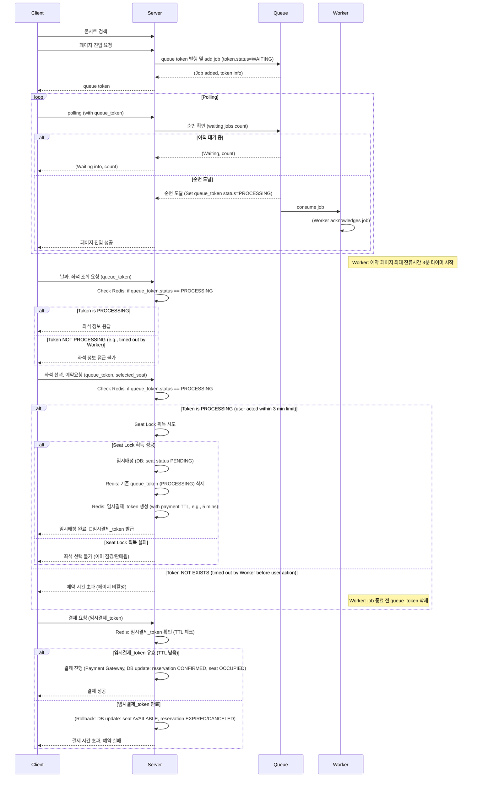
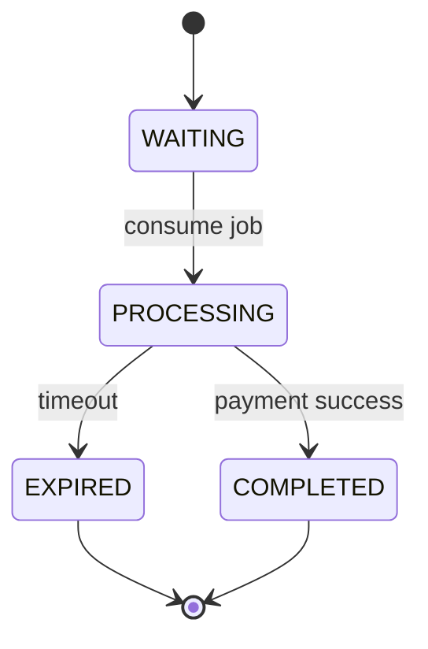

# 시퀀스 다이어그램
 

```mermaid
sequenceDiagram
    participant C as Client
    participant S as Server
    participant Q as Queue
    participant W as Worker

    C->>S: 콘서트 검색
    C->>S: 페이지 진입 요청
    S->>Q: queue token 발행 및 add job (token.status=WAITING)
    Q-->>S: (Job added, token info)
    S-->>C: queue token

    loop Polling
        C->>S: polling (with queue_token)
        S->>Q: 순번 확인 (waiting jobs count)
        alt 아직 대기 중
            Q-->>S: (Waiting, count)
            S-->>C: (Waiting info, count)
        else 순번 도달
            Q-->>S: 순번 도달 (Set queue_token status=PROCESSING)
            Q->>W: consume job
            W->>W: (Worker acknowledges job)
            S-->>C: 페이지 진입 성공
        end
    end

    Note right of W: Worker: 예약 페이지 최대 잔류시간 3분 타이머 시작

    C->>S: 날짜, 좌석 조회 요청 (queue_token)
    S->>S: Check Redis: if queue_token.status == PROCESSING
    alt Token is PROCESSING
        S-->>C: 좌석 정보 응답
    else Token NOT PROCESSING (e.g., timed out by Worker)
        S-->>C: 좌석 정보 접근 불가
    end

    C->>S: 좌석 선택, 예약요청 (queue_token, selected_seat)
    S->>S: Check Redis: if queue_token.status == PROCESSING
    alt Token is PROCESSING (user acted within 3 min limit)
        S->>S: Seat Lock 획득 시도
        alt Seat Lock 획득 성공
            S->>S: 임시배정 (DB: seat status PENDING)
            S->>S: Redis: 기존 queue_token (PROCESSING) 삭제
            S->>S: Redis: 임시결제_token 생성 (with payment TTL, e.g., 5 mins)
            S-->>C: 임시배정 완료, 🔺임시결제_token 발급
        else Seat Lock 획득 실패
            S-->>C: 좌석 선택 불가 (이미 잠김/판매됨)
        end
    else Token NOT EXISTS (timed out by Worker before user action)
         S-->>C: 예약 시간 초과 (페이지 비활성)
            Note right of W: Worker: job 종료 전 queue_token 삭제
    end

    C->>S: 결제 요청 (임시결제_token)
    S->>S: Redis: 임시결제_token 확인 (TTL 체크)
    alt 임시결제_token 유효 (TTL 남음)
        S->>S: 결제 진행 (Payment Gateway, DB update: reservation CONFIRMED, seat OCCUPIED)
        S-->>C: 결제 성공
    else 임시결제_token 만료
        S->>S: (Rollback: DB update: seat AVAILABLE, reservation EXPIRED/CANCELED)
        S-->>C: 결제 시간 초과, 예약 실패
    end
```

---
# 상태전이 다이어그램
 
queue_token 상태 전이

```mermaid
stateDiagram-v2
    [*] --> WAITING
    WAITING --> PROCESSING: consume job
    PROCESSING --> EXPIRED: timeout
    PROCESSING --> COMPLETED: payment success
    EXPIRED --> [*]
    COMPLETED --> [*]
```
